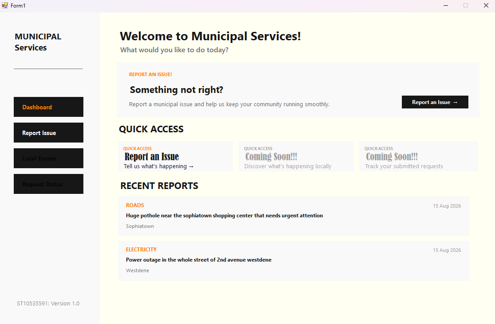
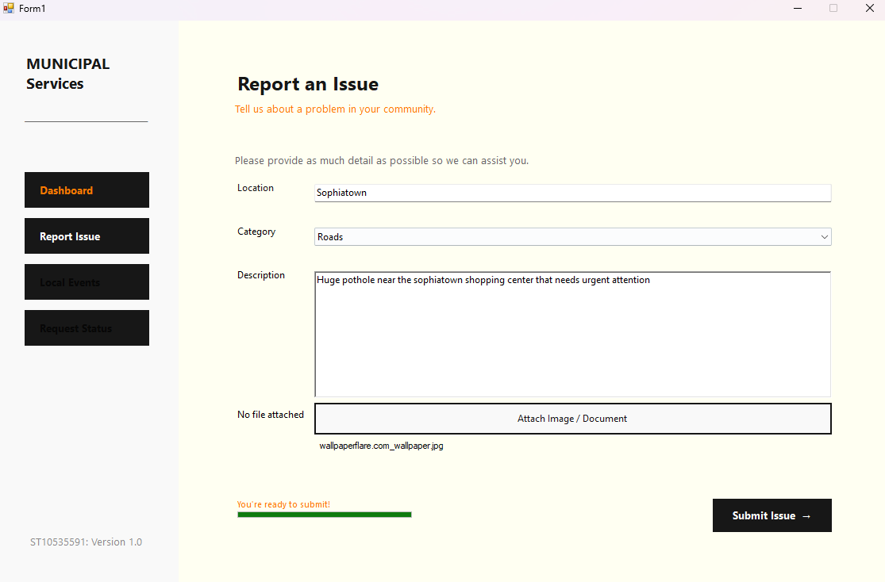
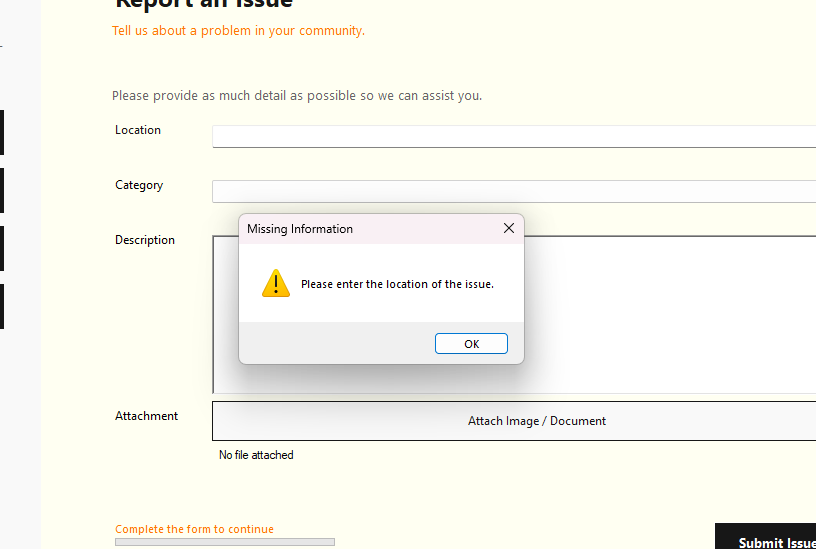
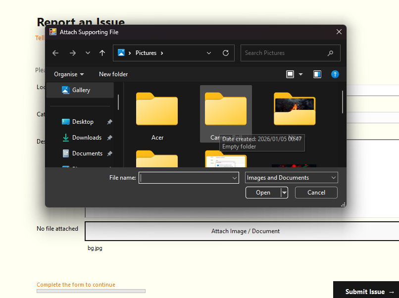
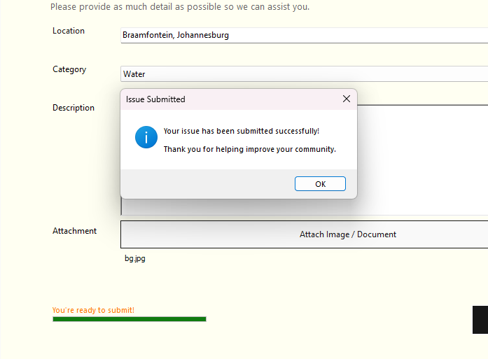

# 🏙️ Municipal Services Application - ST10535591

A simple Windows Forms desktop application designed to allow community members to report municipal service issues quickly and easily.

The application was developed as **Part 1** of the project, focusing on the core issue-reporting workflow, user-friendly navigation, validation, attachments, and displaying recently submitted reports.

---

## 🚀 Getting Started

### Requirements

Before running the application, make sure you have:

- 🪟 Windows 10 or Windows 11
- 💻 Visual Studio 2022 or later
- 🧩 .NET Desktop Development workload
- 📦 Any NuGet packages required by the project

No database server is required for Part 1.

---

## 📥 Download / Clone the Project

Clone the GitHub repository:

    git clone https://github.com/CodeByRelo/MunicipalServicesApp.git

Or download the repository as a ZIP file from GitHub and extract it.

---

## ▶️ Compile and Run

1. Open `MunicipalServicesApp.sln` in Visual Studio.
2. Allow Visual Studio to restore the required packages.
3. Select **Build → Build Solution**.
4. Confirm that the solution builds successfully.
5. Press **F5** or select **Debug → Start Debugging**.

The Municipal Services application will open with the main dashboard.

---

# 🧭 Using the Application

## 🏠 Dashboard

The dashboard is the main entry point of the application.

It provides:

- Welcome section
- Report Issue action
- Quick Access
- Recent Reports
- Sidebar navigation

The user can select **Report Issue** from the sidebar or use one of the Report Issue actions available on the dashboard.

---

## 🚨 Reporting an Issue

To submit a municipal issue:

1. Select **Report Issue**.
2. Enter the issue location.
3. Select an issue category.
4. Enter a description.
5. Optionally attach supporting evidence.
6. Select **Submit Issue**.

### Available Categories

- 🧹 Sanitation
- 🛣️ Roads
- 💧 Water
- ⚡ Electricity
- 🗑️ Waste Management
- 📌 Other

---

## 📎 Attachments

Users can optionally attach supporting files to their report.

Supported formats include:

- JPG
- JPEG
- PNG
- PDF
- DOC
- DOCX

After selecting a file, its filename is displayed on the form.

Attachments are optional.

---

## 📊 Form Progress

The Report Issue form provides simple progress feedback based on the completion of the required fields:

- Location
- Category
- Description

The progress messages change as the user completes the form:

> Complete the form to continue  
> Good start!  
> Almost there!  
> You're ready to submit!

---

## ✅ Submitting an Issue

Before an issue is submitted, the application checks that:

- A location has been entered.
- A category has been selected.
- A description has been provided.

If information is missing, the user receives a warning and is returned to the relevant field.

Once all required information has been provided, the issue is added to the application's issue collection and a confirmation message is displayed.

---

## 📰 Recent Reports

Submitted issues appear on the dashboard under **Recent Reports**.

Each report displays:

- Category
- Description
- Location
- Date reported

The newest reports are displayed first.

If there are no reports, the dashboard displays:

> No reports submitted yet.

---

# 🛠️ Technical Overview

### Technology

- **Language:** C#
- **Framework:** Windows Forms / .NET
- **IDE:** Visual Studio
- **Source Control:** GitHub
- **Storage:** In-memory collection for Part 1

### Project Structure

    MunicipalServicesApp
    │
    ├── Data
    │   └── IssueRepository.cs
    │
    ├── Forms
    │   ├── ReportIssueForm.cs
    │   └── ReportIssueForm.Designer.cs
    │
    ├── Models
    │   └── Issue.cs
    │
    ├── MainForm.cs
    ├── MainForm.Designer.cs
    ├── Program.cs
    └── MunicipalServicesApp.csproj

---

# 💾 Data Storage

Part 1 uses an in-memory `List<Issue>` through the shared `IssueRepository`.

The basic flow is:

**User → Report Issue Form → Issue → IssueRepository → Recent Reports**

This keeps the implementation simple while demonstrating the complete reporting workflow.

⚠️ **Important:** Because the data is stored in memory, submitted reports are cleared when the application is closed. Permanent database storage can be introduced in a future version.

---

# 🎨 User Interface

The application uses a modern, minimal visual style based around:

- 🤍 Off-white backgrounds
- 🖤 Black primary actions and text
- 🟠 Orange accent colour
- ◻️ Light grey supporting elements
- Clean spacing
- Clear visual hierarchy
- Simple navigation
- Minimal visual clutter

The goal is to keep the application easy to understand while providing a more modern experience than the default Windows Forms appearance.

---

# 📸 Screenshots

Screenshots of the completed application are available below.

### 🏠 Main Dashboard and 📰 Recent Reports

### 🚨 Report Issue

### ⚠️ Form Validation

### 📎 File Attachment

### ✅ Successful Submission

---

# ⚠️ Current Limitations

Part 1 intentionally keeps the application simple.

Current limitations include:

- Reports are not permanently stored.
- No database is currently used.
- No authentication is implemented.
- No user accounts are required.
- Attachments are not permanently stored.
- Local Events functionality is not implemented.
- Request Status functionality is not implemented.

These features can be considered for future versions.

---

# 🔮 Future Improvements

Potential future improvements include:

- 🗄️ Database persistence
- 📁 Permanent attachment storage
- 📊 Request status tracking
- 📅 Local Events
- 🔎 Search and filtering
- 🎨 Further UI improvements
- 🔐 Authentication
- 🧩 Reusable custom UI controls
- ✨ Additional icons and visual enhancements

---

# 📂 Source Code

The complete source code is available on GitHub:

**Repository:** https://github.com/CodeByRelo/MunicipalServicesApp.git

---

# 👨‍💻 Project Information

**Application:** Municipal Services Application  
**Part:** Part 1  
**Version:** 1.0  
**Developer:** Tshwarelo Lephoto - ST10535591

---

## 📌 Part 1 Summary

Part 1 establishes the core functionality of the Municipal Services Application.

The completed workflow allows a user to:

**Open the application → Report an issue → Provide details → Attach evidence → Submit → View the report on the dashboard.**

The application focuses on keeping the experience **simple, clear, functional, and user-friendly** while providing a foundation for future development.
